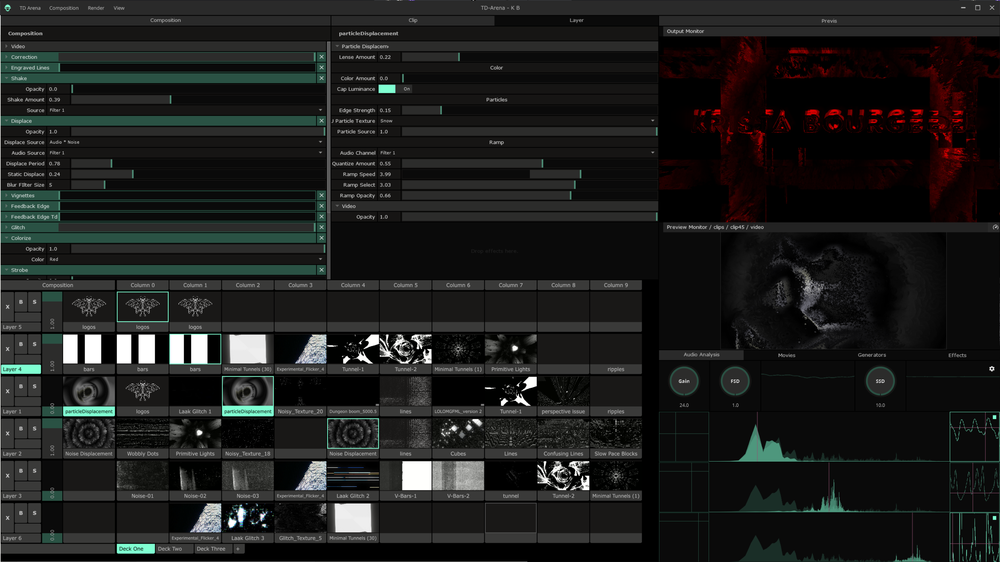

# TD Areana


This project is heavily inspired by [Resolume Arena](https://resolume.com/). I wanted something that allowed me to perform like you might with arena, but allowing for sources other than just video (`tox`, `notch`, etc.) and custom effects built in TD.

## 🚧 Under Active Development 🚧

[Current backlog of planned features.](https://github.com/llwt/TD-Arena/projects/1)

This is not yet in a working state. If you're curious about any of this, please reach out through a github issue or ping me over in the [TouchDesigner discord](http://td-discord.com/) `@lolwut#2076`.



## Contributing

I'm currently developing this using [VS Code](https://code.visualstudio.com/) on Windows. Instructions for setting up a development environment as I'm using it are below.

**Note:** I don't use python much in my day job, or windows for that matter. If there are better ways to manage any of this I'd love to hear how it can be improved!

### Python

Install the [version of python TouchDesigner is using](https://docs.derivative.ca/Release_Notes#New_Python), currently `3.7.2`.

_My personal preference is through [pyenv](https://github.com/pyenv/pyenv) running in [wsl](https://docs.microsoft.com/en-us/windows/wsl/install-win10)._

```
pyenv install 3.7.2
pyenv rehash
pip install --upgrade pip
```

#### Telling TouchDesigner to use VSCode in WSL

In order to have TouchDesigner use VScode within your WSL environment when using the edit shortcut, you have to use a little bit of scripting.

Create a powershell script somewhere on your computer with the following content:

_For example `C:\Users\Steven\Bin\util\wslcode.ps1`_

```ps1
& wsl code "`$(wslpath `"$args`")"
```

Then in the TouchDesigner preferences set `DATs -> Text Editor` to the following, replacing the path with your path:

```ps1
powershell.exe C:/Users/Steven/Bin/util/wslcode.ps1
```

### Pipenv

Project dependencies are currently managed through [pipenv](https://pipenv.pypa.io/en/latest/install/#installing-pipenv). At the moment this is just linting and formatting configuration with pre-commits to run them automatically.

**Note:** An empty `.venv` directory is committed so the vscode config can use a relative path to python for dev tools like `pytest`.

```sh
pip install pipenv
pipenv install --dev
pipenv shell
pre-commit install
```

### A Note about code style

_I was originally using [black](https://github.com/psf/black) but have switched to [yapf](https://github.com/google/yapf) with a modified config to allow python generated from touch to be in the same format as the project files. The primary incompatabilities with `black` were `tabs` and `single quotes`._
